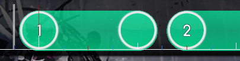

# Deep Learning Final Project : osu! Map Generator

### What we want to do

the aim of our project is input a song and some hyper-parameter, then the model can output the beatmap.

### The Beatmap

<a herf='https://osu.ppy.sh/wiki/Osu_(file_format)'>.osu file format</a>

If anything in this page makes you feel confusing, we can have a discuss.

### How to design the model

##### the hyper-parameter

* Star Difficulty: this parameter isn't in the beatmap of training set, but it's really important(I guess), so we should crawler it from the <a herf=http://osu.ppy.sh>osu.ppy.sh</a>.
* HPDrainRate (Float): specifies the HP Drain difficulty. 
* CircleSize (Float): specifies the size of hit object circles.
* OverallDifficulty (Float): specifies the amount of time allowed to click a hit object on time.
* ApproachRate (Float): specifies the amount of time taken for the approach circle and hit object to appear.
* SliderMultiplier (Float): specifies a multiplier for the slider velocity. Default value is 1.4 .
* SliderTickRate (Float): specifies how often slider ticks appear. Default value is 1.

#####  How to read music

 ToDo

##### Model

I divided the map generator into three separate model:

1. Timing

   > Timing Points describe a number of properties regarding offsets, beats per minute and hit sounds. Offset (Integer, milliseconds) defines when the Timing Point takes effect. Milliseconds per Beat (Float) defines the beats per minute of the song. For certain calculations, it is easier to use milliseconds per beat. Meter (Integer) defines the number of beats in a measure. Sample Type (Integer) defines the type of hit sound samples that are used. Sample Set (Integer) defines the set of hit sounds that are used. Volume (Integer) is a value from 0 - 100 that defines the volume of hit sounds. Kiai Mode (Boolean) defines whether or not Kiai Time effects are active. Inherited (Boolean) defines whether or not the Timing Point is an inherited Timing Point.

   so we can easily find, what we should to measure is offset and BPM. In our model these two value is not so important, so we can measure bpm by <a herf=  http://citeseerx.ist.psu.edu/viewdoc/summary?doi=10.1.1.63.5712>existing algorithms</a>(the code is <a herf= https://github.com/scaperot/the-BPM-detector-python>here</a>) ,and measure offset by Adobe Audition(sorry I still don't know how to get feature auto now, but it's not affect us model.)

2. type determinate

   In the model we want to determine at what time what kind of node should be here.

   I divide the node into four types: Hit-circles, Sliders, Spinners and None

   first, I must introduce the Beat snap divisor. The Beat snap divisor divides every beat time into 4. 6. 8. 12 or 16 part. The Beat time is time/BPM. and every node all will begin/end at the beat snap divisor like that:

   

    so, we can easily discretization time same as the Beat snap divisor(most divide Beat time into 4 part, some divide it into 8 part, the other is very rare and we can ignore them).

   After discretization time, I guess we can use a HMM model to determine the type of node like a Acoustic model. Let the type of node as four value  of a hidden various.

   reference :

   ​     <a herf='http://www.mirlab.org/jang/books/audioSignalProcessing/ppAcousticModel.asp?title=17-4%20%C1n%BE%C7%BC%D2%AB%AC'>声学模型</a>

   ​     <a href = 'http://www.ece.ucsb.edu/Faculty/Rabiner/ece259/Reprints/tutorial%20on%20hmm%20and%20applications.pdf'>A tutorial on Hidden Markov Models and selected applications in speech recognition 257-287</a>

3. Position Detector

   This model is simplifier, because at this time we just needs to determine the position of  nodes. As we all know the position of node depend on the position of previous nodes and music and some hyper-parameter. So a RNN of LSTM is a good choice. Even we don't use music, just determinate position of node by the position of precious nodes.

##### Some other

1. Why use HMM in the second model.

   Considering the deadline of out project, massive data and values of hidden variable(the type we want to predict)  is simple, I guess HMM is  a more effictive model than deep neural network. 

2. We should ignore some data.

   the map made before 2011 or 2012. Because the quality of these map is not good and is out-of-date.

3. If the BPM of a song changes, we should seperate the song into several different part. Also, we may separate the song by its Inherited point.

4.  I guess we should hurry up....